# Build a literature bot in three steps
These instructions tell you how to set up a literature bot that automatically posts papers on particular topics to Bluesky. 

We'll use the building of [the phypapers bot on Bluesky](https://bsky.app/profile/phypapers.bsky.social) as an example. It takes about 20 minutes.

Literature bots can be a useful way to keep up with the latest research. Casey Bergman started it all with a Drosophila literature bot called flypapers back when Twitter existed. There are now hundreds similar ones, many built with the instructions below and many of which can be found on this list: https://twitter.com/caseybergman/lists/literaturebots/members. The detailed instructions here were originally inspired by [Casey Bergman's blog post](http://caseybergman.wordpress.com/2014/02/24/keeping-up-with-the-scientific-literature-using-twitterbots-the-flypapers-experiment/). 

> This is a new set of instructions which I've cleaned up substantially, and streamlined for BlueSky. If you're looking for the old instructions, which had notes for Twitter, Tumblr, and things for using Microsoft Flow etc. you can find them here: https://github.com/roblanf/phypapers/tree/v1-twitter.

## The three basic steps

### 1. Set up a twitter account

1. Decide on a name. A suggestion for consistency (following flypapers' lead):
    * "Full Name": something followed immediately by 'papers' (e.g. flypapers, phypapers)
    * "Username": the same as "Full Name" but with an underscore (e.g. fly_papers, phy_papers)
2. Go here: https://twitter.com/
3. Follow the links to set up your new account:
    * Protip 1: you don't necessarily need multiple email accounts. If you already use your gmail address for a personal twitter account, you can just append to it to create a new account. E.g. if your personal account is porcelain.crab@gmail.com, you could use porcelain.crab+phypapers@gmail.com (the '+' stays). I have 4 twitter accounts on the same email address like this.
    * Protip 2: you have to churn through some frustrating steps when signing up. The final one looks like you're going to have to import all your contacts. Just look for the very small 'skip this step' link at the bottom right
4. Sign in to your new account, and stay signed in until you're done with these instructions
5. Suggested: make sure email notifications are turned off
    * Click on the egg symbol next to the "Tweet button" at the top right
    * Click 'settings'.
    * Click 'Email notifications'.
    * If it says 'Email is enabled', click the 'Turn off' button

### 2. Set up a pubmed search

1. Go here: http://www.ncbi.nlm.nih.gov/pubmed/
2. Type in your favourite search terms (e.g.: 'phylogen*', or 'goats')
3. Click "search"
4. Click the "RSS" link (with the orange symbol) just below the search box
5. Set "Number of items to be displayed" to 100
6. Click "Create RSS"
7. Click the orange "XML" box
8. Record the address in your browser's address bar (this example: http://www.ncbi.nlm.nih.gov/entrez/eutils/erss.cgi?rss_guid=1LU7YBGfC-yDnaYBUcYLivlvzqhgKnWemjak5n2h7PxDtGFoHp)

### 3. Set up your dlvr.it account

1. Go here: http://dlvr.it/
2. Follow the steps to sign up for a new account (NB: the same gmail trick that works for twitter works here too...)
3. Paste the RSS feed URL (from step 8, above) into the "Find a Feed" box
4. Click '+' symbol for the feed, it will appear just below the search box
5. Click 'Next: Connect Socials', then select the 'Connect New' and click the Twitter icon and follow the steps authorise dlvr.it to post to your new twitter account
6. Click 'Done'
7. Now tweak the delivery settings:
    * In your dlvr.it homepage, click your new route (mine's called 'phypapers')
    * In the 'Feeds' box, click on the cog symbol next to your pubmed feed
    * Click the 'Feed Update' tab, my suggestions for settings are:
        * Feed update period: 30 minutes
        * Max items per update period: 1
        * Max items per day: 250 (that's the maximum for a free account)
        * Trickle: Newest items first
        * Subscribe to PuSH Updates: off (this stops it posting big PubMed logos with every post)
    * Click 'Save' in the bottom right

That's it. Your new twitterbot is running. Give it a bit of time (a day or two perhaps) to catch up with itself before you tell everyone about it. This lets it fill up with interesting papers, and also allows you to tweak the pubmed search if necessary.

When you're done, please tweet to me (@roblanfear) and Casey Bergman (@caseybergman) with the name of your new twitterbot. It's nice to see what people are buliding, and Casey keeps a list of all the bots that we know of here: https://twitter.com/caseybergman/lists/literaturebots. 

# Going a bit further

### 1. Adding a feed from arxiv preprints

1. Edit this URL to include your search term: 'http://export.arxiv.org/api/query?search_query=all:[YOURSEARCHTERMHERE]&start=0&max_results=10&sortBy=lastUpdatedDate&sortOrder=descending', e.g. for this example: 'http://export.arxiv.org/api/query?search_query=all:phylogen*&start=0&max_results=10&sortBy=lastUpdatedDate&sortOrder=descending'
2. Log into dlvr.it
3. Look for your feed (mine is called 'phy_papers'), and click it to expand the list of feeds
4. Click the 'Add Feed' grey text, just at the top right of the list of current feeds
5. Add the URL to the search box
6. Click '+' symbol for the feed, it will appear just below the search box
7. Your feed will appear in a 'Selected Feed' box. Click the cog symbol at the right.
8. Set your other options as in point 7 of the dlvr.it instructions, above
9. Click the blue 'Save' rectangle in the bottom right

### 2. Adding a feed from bioRxiv preprints
1. Copy this URL, which is an RSS feed from all of bioRxiv http://connect.biorxiv.org/biorxiv_xml.php?subject=all
2. Follow steps 2 to 8 in the arxiv instructions, pasting the biorxiv link into the URL box
3. Under the 'Filters' tab, add your search terms (this example: 'phylogenetics, phylogenomics' and a few related terms)
4. Click 'save source'

### 3. Adding a feed from PeerJ PrePrints

1. Copy this link: https://peerj.com/preprints/index.rss2
2. Follow steps 2 to 8 in the arxiv instructions, pasting the above peerj link into the URL box
3. Under the 'Filters' tab, add your search terms (this example: 'phylogenetics, phylogenomics' and a few related terms)
4. Click 'save source'

### 4. Adding a feed from F1000 Research

1. Copy this link: https://f1000research.com/published/rss
2. Follow steps 2 to 8 in the arxiv instructions, pasting the above F1000 link into the URL box
3. Under the 'Filters' tab, add your search terms (this example: 'phylogenetics, phylogenomics' and a few related terms)
4. Click 'save source'

### 5. Post your feed to tumblr

A few folks on twitter noted that it would be nice to have this feed posted to a non-twitter venue too. Tumblr is a good option here. So let's make dlvr.it post our newly minted literature bot to a tumblr account too. I did this but found that almost no people ever looked at the tumblr, so I removed it. But here are the instructions if you care to use them.

1. Set up a tumblr account here: www.tumblr.com
2. Set the username and title to match your full name for twitter. In this case, I set both to 'PhyPapers'. So this particular tumblr account will be phypapers.tumblr.com.
3. Go to your literature bot on dlvr.it
4. Look for the 'Destinations' box, that right now just has your twitter account in it. Click '+add'.
5. Click the 't' for tumblr, then 'connect to tumblr'
6. In the popup window, click 'Allow'
7. Choose the right blog. In this example, I select 'phypapers' from the drop-down menu, then click 'Select'
8. In the window that's now open, click the 'Post content' tab.
9. Click the 'post body' tick box (this will post abstracts too, which is fine on tumblr where there's enough space for them).
10. Click 'save' in the bottom right.
11. Now visit www.tumblr.com. Click the cog symbol at the top. Then on the right click 'Notifications'. Use the settings here to turn off all email notifactions from this blog (if you want).

### 6. Tweet using Microsoft Flow

1. Download `ms_flows/TrickleRSSfeedstoTwitter.zip` or `TrickleRSSfeedstoTwitter_w_notification.zip` if you want automatic notifications
2. Go here: https://flow.microsoft.com
3. Follow the steps to sign up for a new account (NB: the same gmail trick that works for twitter *does not* work here)
4. Go to Data -> Connections and create connectors:
   * RSS
   * Twitter
   * Notification (optional)  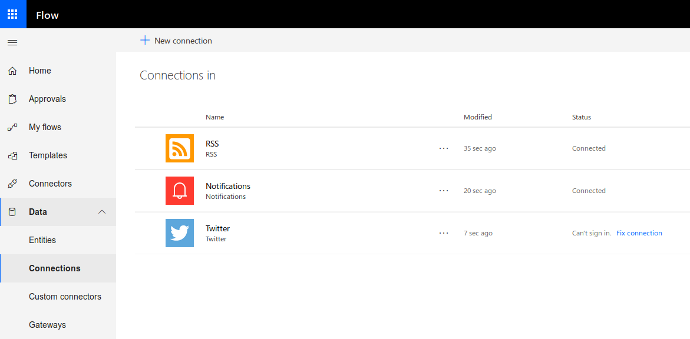 
1. Go to 'My flows' and import `TrickleRSSfeedstoTwitter.zip`. The imported flow has the following components:  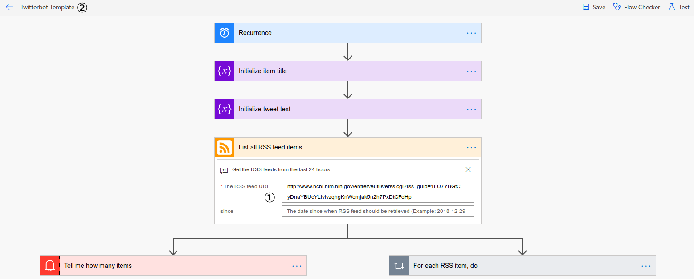 
6. Edit the the imported flow:
   1. Correct the RSS address (default is the porcelain.crab feed)
   2. Correct the Flow name (will automatically be used in the subject line of the notification)

The flow will tweet the items in the RSS feed each and every day - also if there is nothing new under the sun. Why this is, is a little obscure, but Microsoft Flow clearly does not check if the feed has been updated, but this might also be because NCBI does not include a `<pubDate>` tag in the feed. Also, you can obviously tweet the exact same text on different days.

If it is important not to tweet the same paper over and over, look at **Check duplicate tweets**.

#### Step-by-step flow creation

Clearly some of the following steps, such as the truncation of the paper title and the try/catch, can be left out. I use them to be on the safe side of things, but you can go wild.

Especially adjusting the title length might be a little too much, since about [0.25% of the new coming papers on Pubmed](https://rubde-my.sharepoint.com/:x:/g/personal/ulrik_stervbo_rub_de/EdYocDyvmn9Km1DLBaPkEOcBapeM1Cy9f4UgYgSwFxEC0A?e=JgEFvx) have to be truncated.

1. Create new flow from blank
2. Select 'Schedule' connector
3. Set the interval to 24 hours
4. Select the connector 'List all RSS feed items'
5. Add the feed URL
6. Initialize two string variables  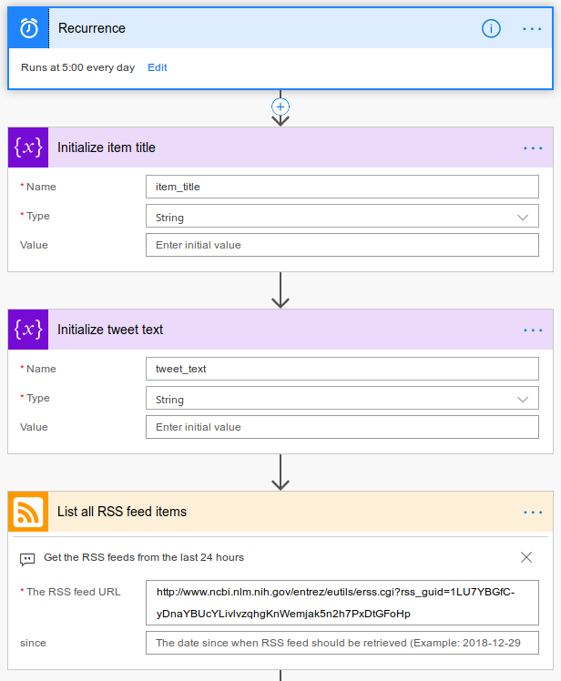
   *  `item_title`
   *  `tweet_text`
7. Optional: Select the 'Send me an email notification' action from the Notification connector  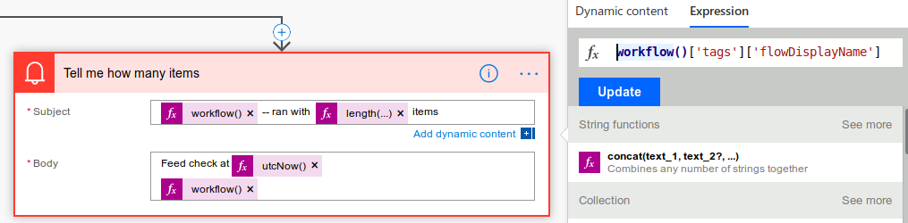
   * Set the Subject to `@{workflow()['tags']['flowDisplayName']}: Number of items: @{length(body('List_all_RSS_feed_items'))}` or something equally meaningful
   * Set the body to `Feed check at @{utcNow()}` or something else
   * Add a parallel branch
8. Add the `Apply to each` connector
9.  Add 'Body' as the 'Select an output from previous steps' value  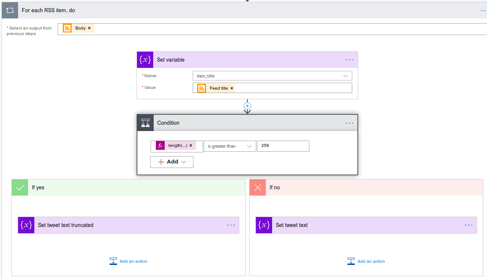
10.  Add a 'Set variable' action from the 'Variables' connector, followed by a 'Condition' action from the 'Control' connector
11.  Set the the value of `item_title` to `Feed title`
12.  Set the condition to be length of `item_title > 253` 
    * The maximum number of characters in a tweet is 280, the URL will always be 23 characters, we will truncate long titles and add `... `; so 280 - 23 - 4 = 253
    * The length of `item_title` is obtained through `@{length(variables('item_title'))}`
13.  To the True branch, add a 'Set variable' action from the 'Variables' connector
14.  Set the the value of `tweet_text` to `@{substring(variables('item_title'), 0, 253)}... Primary feed link`  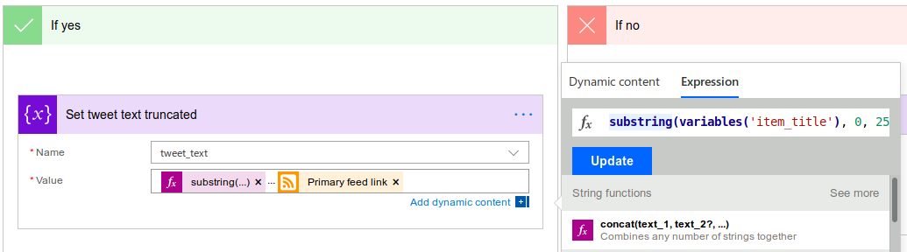
15.  To the False branch, add a 'Set variable' action from the 'Variables' connector
16.  Set the the value of `tweet_text` to `variables('item_title') Primary feed link` or `Feed title Primary feed link`  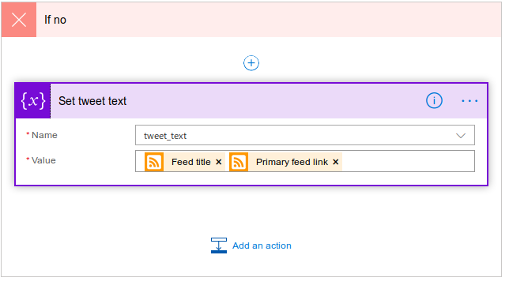
17. Create a Try/Catch block to avoid a flood of errors in case the flow executes without any new RSS items:
    1. Add a two `Scope` actions from the 'Control' connector
    2. Set the letter to run only in case of failure:
       1. Go to the ellipsis, select 'Configure run after', leave only 'has failed' checked  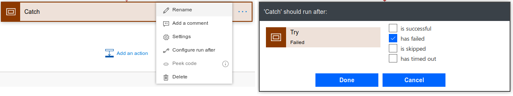
18. In the Try block, set the 'Post a Tweet' action from the Twitter connector  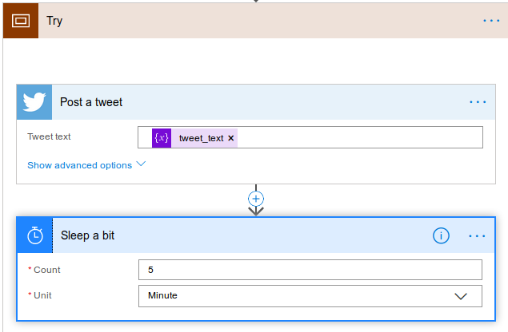
19. Set the tweet text to `@{variables('item_title')`
20. Add the 'Delay' action from the Schedule connector and set Count and Unit to 5 Minutes. With this delay all feed items (max 100) are tweeted in a little more than 8 hours
21. In the Catch block, set the 'Send me an email notification' action from the Notification connector  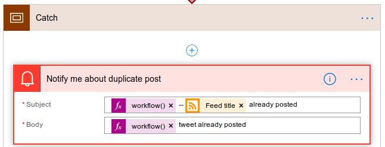
22. Fill in the information you find reasonable - the name of the flow is given by the expression `workflow()['tags']['flowDisplayName']`

#### Check feed repetition

Microsoft Flow provide no way to store information between execution of flows; the work around is to use Google Sheets, Excel Online, or some other cloud based spread sheet. By assuming that a change to the title of the first feed item indicate a completely new feed, we just need to remember a single entry, and not each paper tweeted. Here the usage of Google Sheets will be described, but the ideas will also apply to other cloud spread sheets.

The template `TrickleRSSfeedstoTwitter_no_repeats.zip` is available for download in `ms_flows`.

1. Create a file on Google Sheets called `RSS item titles` and insert the following

    | `__PowerAppsId__` | `TwitterBot` |
    | ----------------- | ------------ |
    | 1                 | NA           |

    The column `__PowerAppsId__` is used my Microsoft Flow to identify the row of interest.

1. Create a connection to the 'Google Sheets' connector
2. Initialize a string variable `first feed title`, and set the variable after the RSS feed has been listed with the expression `body('List_all_RSS_feed_items')?[0]?['title']`.  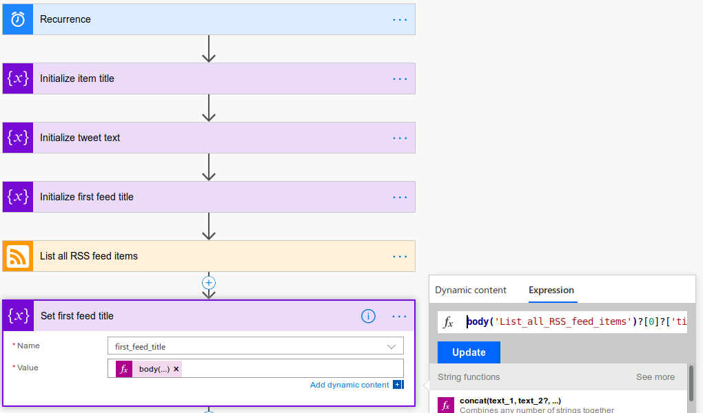
3. Insert the 'Get Rows' action from the 'Google Sheets' connector
   * Select the file and sheet, and no other options.   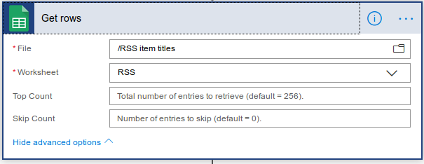
4. Add a 'Condition' action and test equality between `first feed title` (the first paper of the feed) and the value stored in the sheet obtained with the expression `body('get_rows')?['value']?[0]?['TwitterBot']` 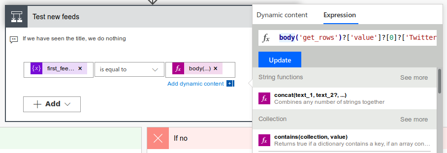
5. If the title is unknown
   1. Update the information in the Google Sheet 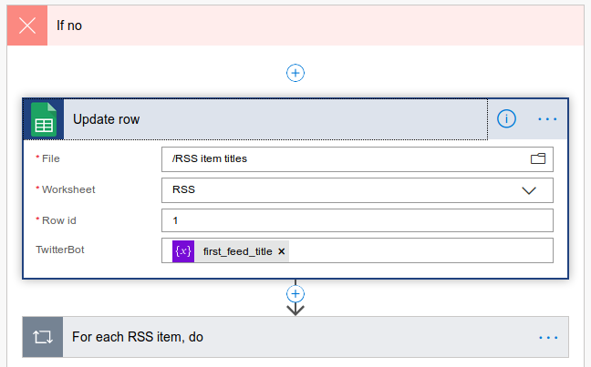
      *  Insert the 'Update Row' action from the 'Google Sheets' connector
      *  Select the file, sheet, and set the row ID to 1
      *  Set the option TwitterBot to `first feed title`
   2. Add the `Apply to each` connector and continue as above

### 7. Tweak, revise, repeat

Make sure you follow and check your own feed. If it seems like it's posting rubbish, go tweak the search terms. For example, I noticed that the search above, using 'phylogen*' in pubmed, gathers all sorts of papers that just happen to have estimated a phylogenetic tree. That's not what I want, since the focus of most of those papers is often nothing to do with phylogenetics. So I revised my searches to be more specific. I now use this:

phylogenetics OR phylogenomics OR "phylogenetic analysis" OR "phylogenomic analysis" OR "phylogenetic analyses" OR "phylogenomic analyses" OR "phylogenetic methods" OR "phylogenomic methods" OR phyloinformatics OR "phyloinformatic analysis" OR "phyloinformatic analyses" OR "phyloinformatic methods" OR "phyloinformatic methods"

Long and unwieldy, but more precisely targeted to my interests, and less likely to fill mine and other people's streams with content we're not interested in.

If you find any mistakes or omissions in this document, raise an issue on the github page and I'll fix it.

This is free to use and redistribute under a CC0 license.
